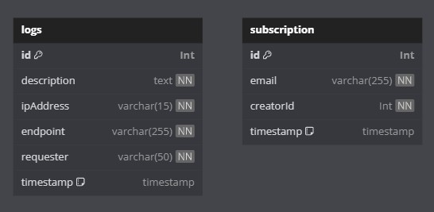

# Puisiku SOAP Service

The Puisiku SOAP Service is a powerful backend service that provides subscription services and activity logging. It is built using JAX-WS and utilizes a MySQL database.

## Overview

This service is designed to track the activity of the Puisiku application, providing valuable insights into user behavior and system performance. It also offers subscription services, allowing users to stay updated with the latest content.

## Getting Started

To set up and run the Puisiku SOAP Service, follow these steps:

1. Create a new file named `.env` and copy the contents of the `.env.example` file into it. You can use the default credentials provided or replace them with your own.

```bash
MYSQL_HOST=puisiku-soap-db
MYSQL_PORT=3306
MYSQL_ROOT_PASSWORD=puisiku
MYSQL_DATABASE=puisiku
MYSQL_USER=puisiku
MYSQL_PASSWORD=puisiku

PHP_API_KEY=fromphp
REST_API_KEY=fromrest

EMAIL_USERNAME=2070c7d89b4616
EMAIL_PASSWORD=3ee40c47ec487d
EMAIL_TO=13521046@std.stei.itb.ac.id
```

2. Execute the following command to build and start the application:
```bash
docker compose up -d --build
```

The service will be available at `localhost:8888`. To interact with this service from PHP, use `x-api-key` on the request header with the value `fromphp`. For REST, use `fromrest`. The value of this header depends on what is set in the `.env` file.

## Database Scheme



## API Endpoints

| Method | Endpoint      | Operation            | Description                                |
|--------|---------------|----------------------|--------------------------------------------|
| POST   | /subscription | getSubscribedCreator | Get the user’s subscribed creators         |
| POST   | /subscription | getSubscriberCount   | Get the number of a creator’s subscribers  |
| POST   | /subscription | subscibe             | Join a premium creator’s subscriber list   |


## Task Division

| Task                      | Contributor  |
|---------------------------|--------------|
| Docker and Infrastructure | 13521046     |
| Email                     | 13521046     |
| getSubscribedCreators     | 13521046     |
| getSubscriberCount        | 13521103     |
| Logging                   | 13521046     |
| subscribe                 | 13521103     |


## Authors
| NIM      | Nama                    |
|----------|-------------------------|
| 10023334 | Tubagus Rahardi         |
| 13521046 | Jeffrey Chow            |
| 13521103 | Aulia Mey Diva Annandya |
